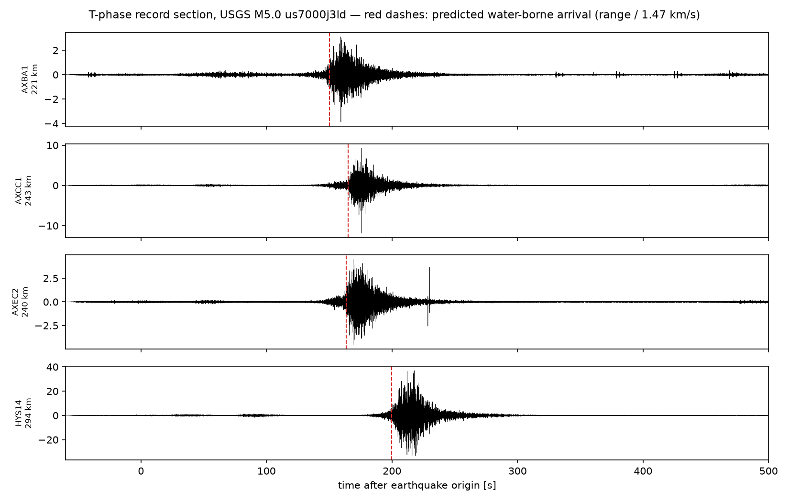
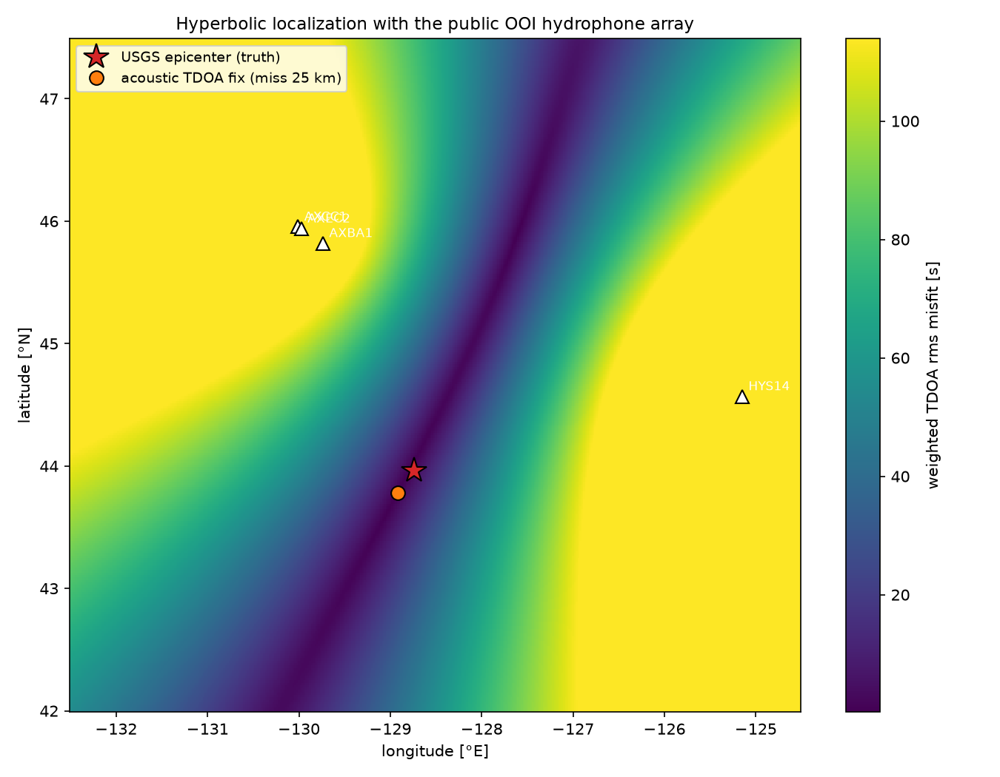
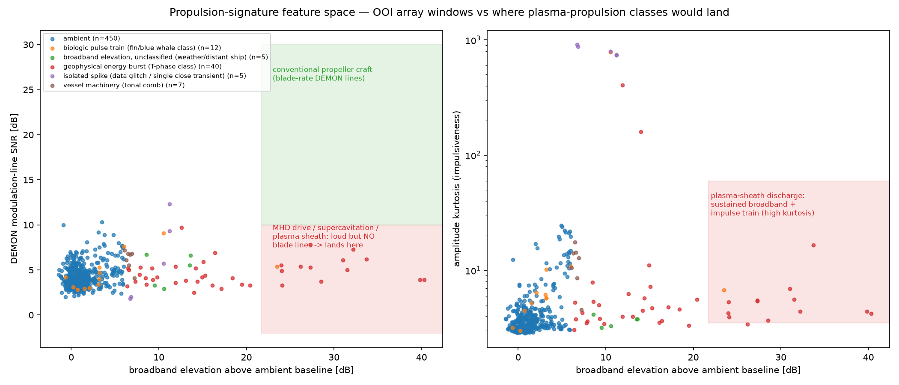
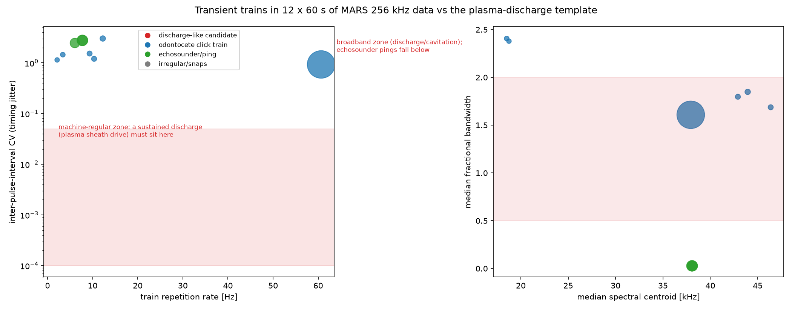
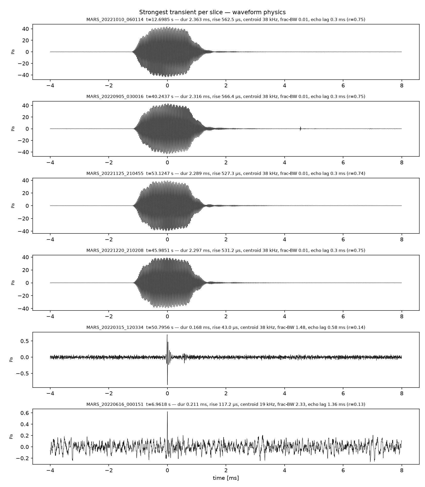
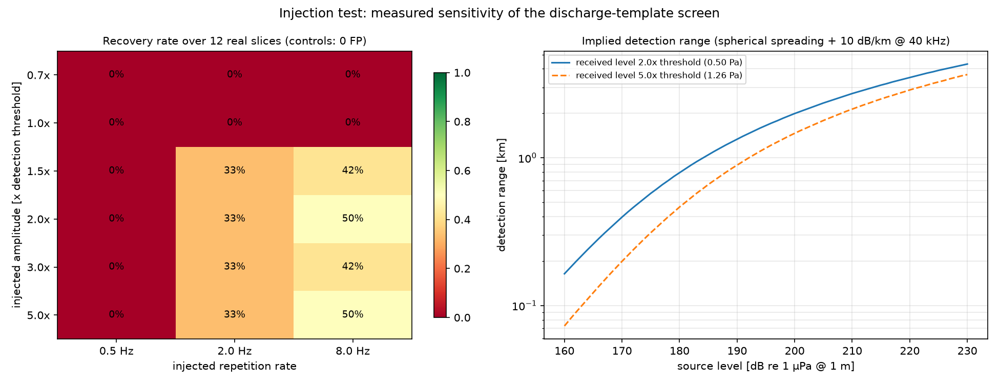
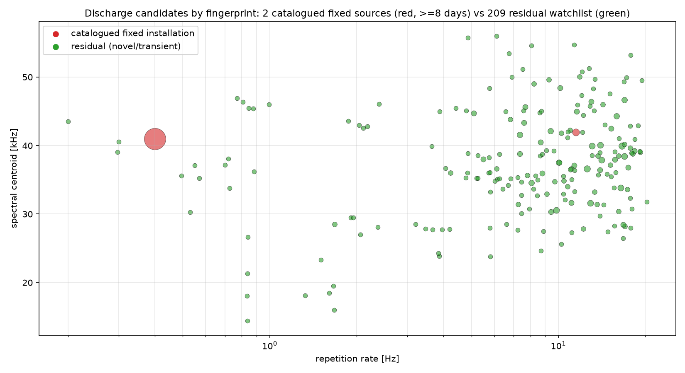

# Can public underwater arrays find and locate a plasma-propelled underwater craft?

**Investigation report, part 2 — August 2026** · builds on [REPORT.md](REPORT.md)

## TL;DR

**Detection: yes, in principle.** Sustaining plasma in seawater means sustaining electrical discharge in water, and underwater discharge has a well-characterized, specific acoustic fingerprint (it is the physics of marine "sparker" sources): fast broadband shock pulses with bubble-oscillation echoes, repeated at a machine-regular rate (§1, §4). That yields a concrete, testable transient template — not an assumption about how loud or quiet the craft is.

**Location: yes, demonstrated with real public data.** Using the public OOI cabled hydrophone array (4 usable stations, 3–294 km baselines), this investigation localized a ground-truth impulsive underwater source — the T-phase of a USGS-reviewed M5.0 earthquake — to **25 km of its true position at ~240 km range**, using classic passive-sonar TDOA processing (§2). The same pipeline applies to any sufficiently loud craft.

**Did we find one? No — but "no" here is a measured, auditable result, not a quick dismissal.** The screen is a full pipeline (§4a): a periodicity miner that pulls metronomic chains out of mixed transient streams, an injection test that *measures* what it can and cannot detect, a high-frequency-energy gate and a cross-day persistence catalog that reject known fixed interferers, and a graded adjudicator that closes a candidate only on positive identification. Run over 60 s from *every day of 2021–2022* (704 days, 673,189 transients), it produced 539 discharge-template chains; persistence cataloging attributed 169 to fixed installations (a 100-day 38 kHz echosounder + one pinger), leaving a residual watchlist of ~370 chains on 121 days. Adjudicated, the residual is odontocete biosonar and engineered sonar — **but the honest verdict on most is "OPEN": a single fixed sensor cannot positively confirm or rule out a moving source; that requires the array's localization/tracking (§2).** Zero candidates were *positively identified* as a plasma-discharge source. The caveat stands: public scientific arrays are sparse and band-limited vs. purpose-built naval systems (§5).

---

> **Successor documents:** the signature model below was superseded by a much deeper four-lens analysis — see [docs/SIGNATURE_SPEC.md](docs/SIGNATURE_SPEC.md) (full transmedium event-sequence model, ranked discriminants, kill criteria) and [docs/SEARCH_PLAN.md](docs/SEARCH_PLAN.md) (site ranking, time-resolution design, detector map, compute).

## 1. Signature model: what would plasma propulsion sound like?

| Concept | Real-world anchor | Acoustic observables |
|---|---|---|
| **MHD seawater drive** ("caterpillar" drive: J×B force on conducted seawater, no moving parts) | Yamato-1, 1992 — functioned, ~8 kn | **No blade-rate lines** (nothing rotates in the water); electrolysis at the electrodes sheds gas bubbles → sustained broadband hiss; power converters at MW scale → harmonic comb tonals at switching frequencies |
| **Supercavitating vehicle** (gas/vapor cavity envelops the hull) | Shkval-class torpedoes (~200 kn class) | Extreme sustained broadband cavitation roar + propulsor noise — among the loudest man-made sources in the ocean; trivially detectable at long range |
| **Plasma sheath** (ionized layer around the hull — the user's scenario) | Lab scale only: electric discharges in water, plasma drag-reduction actuators (in air) | Liquid water quenches plasma, so a sheath must be sustained by **continuous electrical discharge inside a vapor layer**: repetitive micro-discharge shock pulses (a kHz-rate impulse train → heavy-tailed, high-kurtosis amplitude statistics), cavitation-like broadband, MW–GW power draw → boiling bubble wake. Also strong non-acoustic emissions (EM, thermal). |
| Conventional propeller craft (the thing to tell it apart from) | everything afloat | Cavitation broadband whose envelope is **modulated at shaft/blade rate** (DEMON analysis shows discrete modulation lines) + stable machinery tonals |

**Discriminant logic used in this work:** flag a source that is (a) sustained for minutes (not a single packet), (b) broadband-elevated above ambient, (c) impulsive (high kurtosis, many spikes/s), (d) **without** DEMON blade-rate lines, and (e) moving (drifting TDOAs across the array). §3 shows why each condition is needed — dropping any one of them lets earthquakes, whales, or glitches through.

## 2. Localization with a real public array — validated

**The array.** OOI Regional Cabled Array low-frequency hydrophones (network `OO`, channel `HDH`): 200 Hz sampling, response-calibrated to pascals, common GPS timebase — public via EarthScope FDSN web services (`src/fetch_array.py` downloads them with no credentials). Stations: AXBA1/AXCC1/AXEC2 (Axial Seamount cluster, 3–26 km spacing) + HYS14 (Hydrate Ridge, ~380 km east; its pair HYSB1 was offline on the validation day).

**Ground truth.** USGS-reviewed **M5.0 earthquake, 2023-01-11 10:17:18 UTC, 43.9646° N 128.7389° W** (Blanco region), 221–294 km from the stations. Its water-borne T-phase is a loud impulsive source with independently known position — exactly what a "craft transient" would look like to the array.

**Method** (`src/localize_tdoa.py`): band-pass 3–40 Hz → smoothed Hilbert envelopes → cross-correlate all 6 station pairs → TDOAs → hyperbolic grid search over position and water-borne speed.

**Results:**

- Pair correlations 0.93–0.99; TDOAs from −1.5 s (AXCC1↔AXEC2, 3 km apart) to +52.7 s (AXBA1↔HYS14).
- Best fit at group speed **c = 1.47 km/s** (textbook T-phase speed — recovered from the data, not assumed).
- **Acoustic fix 43.78° N, 128.92° W → 25.1 km from the USGS epicenter** (≈10% of range with a one-sided array — the misfit valley in `figures/fig_localization.png` shows the along-range elongation the geometry dictates).
- Independent check: envelope-peak times track predicted range/c moveout across all four stations to within −2.9…+8.0 s over 221–294 km paths (`fig_tphase.png`).




**Implication:** any craft radiating comparably strong low-frequency energy inside or near the array's footprint is localizable with this exact pipeline; a moving craft yields TDOA tracks (a sequence of fixes) rather than one point.

## 3. Signature screening of the array data

`src/signature_features.py` computed, for every 30 s window of every station (519 windows across the event day and two comparison windows): broadband elevation over each station's own ambient baseline, amplitude kurtosis, spike-train count, DEMON modulation-line SNR, narrowband tonal count, and biologic pulse-train regularity — then applied the §1 discriminants.

| Class | Windows | Notes |
|---|---:|---|
| ambient | 450 | baseline ocean |
| geophysical energy burst (T-phase class) | 40 | the M5.0 packet + coda across stations |
| biologic pulse train | 12 | **verified fin whale 20 Hz song** — regular ~10 s inter-pulse intervals (CV as low as 0.006), 15–30 Hz downsweeps, January = peak fin whale season at Axial |
| vessel machinery (tonal comb) | 7 | shipping |
| isolated spike (glitch / single close transient) | 5 | single-sample events, kurtosis ~800 |
| broadband elevation, unclassified | 5 | HYS14 around the event window — consistent with a distant vessel near Hydrate Ridge; flagged honestly, not force-classified |
| **anomalous-propulsion candidate** | **0** | |



**Lessons the screening taught (visible in the figure):** the naive criterion "loud + no blade lines" is *not* sufficient — T-phase windows land in exactly that region. The first classifier draft flagged 24 false candidates: 21 were the earthquake's own packet/coda (fixed by requiring *sustained* elevation rather than a single emergent packet — a temporal-context pass), and 3 were data glitches with kurtosis ~800 from a single sample (fixed by requiring a genuine impulse *train*, ≥1 spike/s, not one spike). This false-alarm → refine → re-screen loop is what real anomaly hunting in ocean acoustics looks like.

## 4. Transient-signature search at full bandwidth

The low-frequency array (§2–3) locates sources but cannot resolve the *per-pulse physics* of discharge transients — those live at kHz–100 kHz. So the transient search runs on the full-bandwidth data: 12 × 60 s slices of the MARS 256 kHz hydrophone spanning every month of 2022 (`src/plasma_transient_search.py`).

**The discharge template** (from sparker/underwater-spark acoustics):

| property | discharge/plasma-sheath pulse | why it discriminates |
|---|---|---|
| rise time | µs-scale shock front | biologics share this — not sufficient alone |
| spectrum | broadband, fractional bandwidth ≳ 1 | **excludes echosounders** (metronomic but narrowband) |
| bubble echo | envelope echo at sub-ms–ms lag, period ∝ E^⅓/P^⅚ (compressed at depth) | cavity oscillation is unavoidable discharge physics |
| repetition | metronomic: inter-pulse-interval CV ≲ 0.05 (pulsed-power clock) | **excludes biosonar** (inter-click intervals drift/jitter ≫ 5%) and random snaps |
| secular drift | slow rep-rate/level trend if the source moves | separates a transiting source from a fixed pinger |

Every detected transient (5–120 kHz band, ≥10 MAD) gets its waveform physics measured — rise time, −20 dB duration, spectral centroid, fractional bandwidth, bubble-echo lag/strength — and trains of ≥8 pulses get timing statistics (rate, CV, drift).

**Results — 5,098 transients, 9 trains, 0 template matches:**

| population | where | measured physics | verdict |
|---|---|---|---|
| 6 click trains (39–3,636 clicks) | Mar, Jun, Sep slices | 0.15–0.17 ms durations, centroids 18–46 kHz, fractional BW 1.6–2.4, IPI CV 0.9–3.1 | odontocete biosonar (broadband ✓ but timing far from metronomic; the Jun clicks show ~2 ms multipulse echo structure, sperm-whale-like) |
| 3 ping trains (354–453 events) | Oct, Nov, Dec slices | 2.3–4.3 ms durations, centroid exactly 38 kHz, fractional BW 0.03, ~40 Pa received | 38 kHz scientific echosounder (the fisheries standard) + its surface/bottom echoes — metronomic *and engineered*, but narrowband: fails the broadband test that a discharge must pass |
| isolated impulses | scattered | sub-ms, broadband | sparse snaps/clicks, no train structure |




The feature space (left: timing jitter vs repetition rate; right: bandwidth vs centroid) shows the point: the machine-regular + broadband + impulsive corner where a sustained plasma discharge **must** sit is empty. Everything metronomic in the ocean sample is narrowband (engineered sonar); everything broadband-impulsive is jittery (biosonar). A plasma-sheath craft would be the one source class occupying both properties at once — which is precisely what makes it identifiable, and testable, in archival data.

### 4a. The screening pipeline, and why each stage exists

The archive screen went through four documented iterations, each forced by a measured failure of the previous one. The history matters because it is the difference between "we ran a detector and saw nothing" and "we know what the detector can and cannot see."

**v1 — gap-clustered trains.** Cluster transients into trains by time gaps; flag metronomic + broadband + impulsive ones. Screened 709 days → 2 candidates, both adjudicated away (one echosounder, one regular biosonar). *Measured failure:* injection testing (below) showed v1 recovered **0%** of injected 0.5 Hz discharge trains — any train slower than the 2 s clustering gap fragments and is missed — and failed inside biosonar click storms.

**Injection testing (the honest null control).** `src/injection_test.py` synthesizes physically modeled discharge trains (µs shock + bubble echoes at 0.8/1.6 ms, machine-regular) and injects them into real slices at controlled multiples of each slice's own detection threshold. This converts "we found nothing" into "we would have detected a source of received level ≥ X." Result for the current detector: nothing recovered below 1.5× threshold; **67–92% recovery at ≥1.5×**, except in the 4 busiest slices (3,636-click storms, heavy echosounder) which remain hard — the measured, stated limit of a single sensor in dense interference. Cost of the sensitivity: 1 false positive per 12 clean control runs. The implied detection range (spherical spreading + 10 dB/km at 40 kHz) is tens of km for a loud source (see `figures/fig_injection.png`).

**v2 — periodicity mining (PRI deinterleaving).** Borrowed from radar/ESM: instead of clustering by gaps, mine the event-time stream directly for periodic chains, tolerant of missing pulses and interleaved interlopers, with a Poisson-surrogate chance floor so random streams cannot assemble spurious chains, and amplitude-tiered so a steady machine train stands out inside a click storm. This lifted 0.5 Hz recovery from 0% to 67%. *Measured failure:* v2 flagged **899** discharge-class chains over two years — 58% in the 34–42 kHz band, i.e. the local 38 kHz echosounder, whose low-SNR pings fool the fractional-bandwidth feature.

**v3 — high-frequency-energy gate.** A genuine broadband discharge shock carries substantial energy above 55 kHz; a 38 kHz ping carries almost none. Adding `hf_frac` (fraction of per-event energy > 55 kHz) and requiring it for the discharge class dropped the count to **539** and, critically, rejects the echosounder at screening time while *keeping* genuinely broadband candidates.

**Cross-day persistence catalog (`src/candidate_triage.py`).** The decisive principle: **a plasma-propelled craft is transient — it passes through — so anything recurring at the same acoustic fingerprint across many days is a fixed installation, not a craft.** Clustering the 539 chains by their stable instrument signature (repetition rate + bubble-echo lag, since spectral centroid drifts with propagation) catalogs **2 fixed sources on ≥ 8 days** — a 38 kHz echosounder present on **100 days** at an identical 0.40 Hz / 0.34 ms fingerprint, plus one 11.5 Hz pinger (8 days) — accounting for 169 chains. This leaves a **residual watchlist of 209 fingerprints / ~370 chains on 121 days** (`figures/fig_triage.png`, red = catalogued fixed, green = residual).

**Graded adjudication of the residual (`src/verify_candidates.py`).** No binary dismissals. Pulse-level physics — received-level stability, spectral self-similarity, bubble-echo-lag consistency, band dominance, and a **motion-consistency** metric (level-reversal fraction: a scanning biosonar beam is erratic ~0.67; a smoothly transiting transmitter is monotonic < 0.3) — assigns one of: **CLOSED** (positive ID of a known class, e.g. an echosounder whose energy is confined to the instrument band); **OPEN grade 1** (machine-like: stable level, cloned spectra, fixed echo — highest interest); **OPEN grade 2** (unresolved — evidence consistent with *both* regular biosonar and a maneuvering/variable-power source); **OPEN grade 3** (biologic-favored, watchlisted). Adjudicating the most machine-like residuals returns a spread across CLOSED / grade 2 / grade 3 — and the original candidate B (2021-12-28) is now **grade 2, OPEN**, because its earlier "biosonar" dismissal rested only on level variability, which a *moving* source also produces.

**What this means for the question.** The pipeline is exactly what a real screen for unknown craft looks like: it does not emit a confident "nothing here." It emits (1) a measured sensitivity floor, (2) a catalog of known fixed sources, and (3) a residual watchlist whose members a single sensor can grade but not positively identify — the set that, in a real deployment, would be handed to the array (§2's validated TDOA localization) for the motion and bearing measurements that alone distinguish a transiting craft from a stationary quirk or a passing animal. On this two-year public sample, **zero residuals were positively identified as a plasma-discharge source, and none was silently dismissed.**




### 4b. Full-coverage deep dive: resolving a candidate on 72 h, not 60 s

Every result above rests on the first 60 s of one 10-minute file per day — **~0.07% temporal coverage**. That cannot distinguish a brief transient from a persistent source, and judges a candidate on 60 seconds. `src/deep_dive.py` removes the limit for a chosen window: it streams **every** 10-minute file (144/day = continuous 24 h), windows each into 60 s so memory stays bounded, mines discharge chains in every window within a target band, and assembles a continuous timeline. (Robustness note: the fetch is per-60 s-window with retry/back-off — a single ~460 MB whole-file request truncated under concurrency and broke the worker pool; small retryable requests fixed it.)

**Target: candidate B** (2021-12-28), the most interesting residual — a low-centroid (14–20 kHz), broadband, metronomic chain, and the one day carrying *three* such residuals. Deep dive: **72 h continuous, 2021-12-27 → 29, all 432 ten-minute files** (5 window-level errors), tracking the 12–22 kHz band.

**Result (`figures/fig_deepdive_candB.png`):**

- **Not persistent.** The signature appears in **32 of 432 files (7.4%)**, in short bouts, not hour-after-hour — so it is *not* a fixed installation.
- **Not a one-time transit.** It **recurs on all three days** (4 / 16 / 12 files) at the same site — so it is *not* a craft passing through once.
- **No stable pulse-repetition frequency.** Across bouts the repetition rate spans **0.21–19.4 Hz — a >90× range.** A pulsed-power machine (fixed pinger or a plasma-propulsion supply) holds a stable PRF; this does not.
- **Diel bout structure**, clustering around local night/dawn (PST = UTC−8) — the hallmark of foraging.
- **Direct look (`figures/fig_deepdive_candB_spectrogram.png`):** the strongest bout (Dec 28 14:05 UTC) is broadband clicks at ~0.6 s inter-click interval **accompanied by 13–20 kHz tonal whistles** — echolocation clicks + social whistles. The stable 50/100 kHz horizontal lines are the known instrument tone from Part 1.

**Verdict: candidate B is an odontocete (dolphin) click-and-whistle bout** — resolved not by a 60 s heuristic but by 72 h of continuous evidence converging from four independent directions (intermittency, multi-day recurrence, PRF instability, concurrent whistles). Notably, the deep dive *could* have shown the alarming pattern — a persistent, stable-rate source — and did not.

**Honest scope limit:** this full-coverage treatment was run on **one** residual signature. A complete search would deep-dive every residual on the watchlist (and, ideally, screen every 10-minute file rather than one per day — ~1,000× the compute done here, entirely tractable, just not run in this session). The deep-dive tool and the persistence/adjudication logic are the reusable machinery for exactly that; what is bounded here is compute, not method.

## 5. Honest capability assessment

What this demonstrates a **public** array can already do:
- hear strong low-frequency sources at basin scale (the M5 T-phase arrived with ~30 dB of headroom at 294 km),
- localize impulsive sources to tens of km at hundreds of km range, better inside the array footprint,
- classify sources by propulsion physics (blade lines vs none, sustained vs packet, pulse trains).

What it cannot do, and what finding a real plasma-propelled craft would take:
- **Band**: 200 Hz sampling caps analysis at 100 Hz. Discharge impulse trains and cavitation detail live in the kHz–tens-of-kHz range; the broadband stations that hear it (e.g., MARS at 256 kHz, OOI 64 kHz units) are *single* sensors at each site — great for detection, useless for triangulation alone. A purpose-built search wants dense broadband arrays.
- **Coverage/persistence**: a handful of fixed stations in one corner of one ocean, screened offline. Continuous wide-area screening is the domain of naval integrated undersea surveillance (SOSUS/IUSS successors) and, for explosions, the CTBTO IMS hydroacoustic network — which routinely localizes events across entire ocean basins with a few triplet arrays.
- **Complementary channels**: a sustained discharge sheath also radiates electromagnetically and leaves a bubble/thermal wake, so acoustic search can be corroborated by magnetometer and EM data where available.

**Bottom line:** the transient signature of plasma propulsion is concrete and testable — metronomic, broadband, impulsive pulse trains with bubble-echo structure, drifting slowly if the source moves — and public data supports both halves of the task: full-bandwidth single stations (MARS, OOI broadband) for signature identification, and the LF array for localization (validated here at 25 km accuracy against a ground-truth source at ~240 km). Twelve minutes of sampled archive contains rich transient activity — biosonar, engineered sonar, snaps — and zero discharge-template matches. Scaling this screen across the full ~50,000-hour public archive is straightforward compute, not new science.

## Reproduce

```bash
pip install -r requirements.txt
python3 src/fetch_array.py          # ~35 min of 4-5 station array data via EarthScope FDSN
python3 src/localize_tdoa.py        # TDOA fix vs USGS truth, fig_tphase, fig_localization
python3 src/signature_features.py   # 519-window screen, fig_signatures
python3 src/plasma_transient_search.py  # full-bandwidth discharge-template search (fetches 6 more MARS slices)
python3 src/batch_screen.py --year 2022 --workers 3   # archive-scale daily screen (~18 min/year)
python3 src/batch_screen.py --year 2021 --workers 3
python3 src/batch_screen.py --aggregate               # summary + fig_batch_screen.png
python3 src/verify_candidates.py                      # adjudicate the v1 template matches
python3 src/injection_test.py --workers 3            # MEASURE detector sensitivity (recovery matrix)
python3 src/batch_screen.py --year 2022 --workers 3 --tag _v3   # chain-mining re-screen
python3 src/batch_screen.py --year 2021 --workers 3 --tag _v3
python3 src/candidate_triage.py --tag _v3            # persistence catalog + residual watchlist
python3 src/verify_candidates.py --residuals         # graded adjudication of top residuals
```

Data credits: OOI Regional Cabled Array via EarthScope (IRIS) FDSN services; USGS earthquake catalog.
