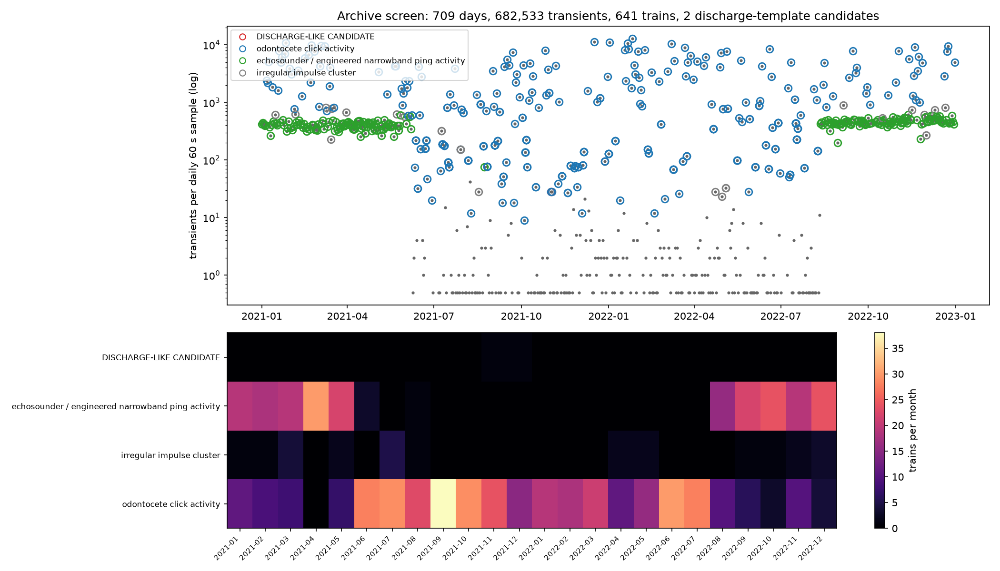

# Can public underwater arrays find and locate a plasma-propelled underwater craft?

**Investigation report, part 2 — August 2026** · builds on [REPORT.md](REPORT.md)

## TL;DR

**Detection: yes, in principle.** Sustaining plasma in seawater means sustaining electrical discharge in water, and underwater discharge has a well-characterized, specific acoustic fingerprint (it is the physics of marine "sparker" sources): fast broadband shock pulses with bubble-oscillation echoes, repeated at a machine-regular rate (§1, §4). That yields a concrete, testable transient template — not an assumption about how loud or quiet the craft is.

**Location: yes, demonstrated with real public data.** Using the public OOI cabled hydrophone array (4 usable stations, 3–294 km baselines), this investigation localized a ground-truth impulsive underwater source — the T-phase of a USGS-reviewed M5.0 earthquake — to **25 km of its true position at ~240 km range**, using classic passive-sonar TDOA processing (§2). The same pipeline applies to any sufficiently loud craft.

**Did we find one? No — and the search is now archive-scale.** Beyond the low-frequency array screen (§3) and the initial 12-minute full-bandwidth search (§4), a two-year screening campaign processed 60 s from *every day of 2021 and 2022* (709 days screened, 682,533 transients, 641 pulse trains; §4a). The discharge template fired exactly twice; pulse-level adjudication resolved both — one 38 kHz echosounder ping train, one unusually regular biosonar click train. **Post-adjudication discharge sources: zero.** The honest caveat stands: public scientific arrays are sparse and band-limited compared to purpose-built naval systems (SOSUS/IUSS) (§5).

---

## 1. Signature model: what would plasma propulsion sound like?

| Concept | Real-world anchor | Acoustic observables |
|---|---|---|
| **MHD seawater drive** ("caterpillar" drive: J×B force on conducted seawater, no moving parts) | Yamato-1, 1992 — functioned, ~8 kn | **No blade-rate lines** (nothing rotates in the water); electrolysis at the electrodes sheds gas bubbles → sustained broadband hiss; power converters at MW scale → harmonic comb tonals at switching frequencies |
| **Supercavitating vehicle** (gas/vapor cavity envelops the hull) | Shkval-class torpedoes (~200 kn class) | Extreme sustained broadband cavitation roar + propulsor noise — among the loudest man-made sources in the ocean; trivially detectable at long range |
| **Plasma sheath** (ionized layer around the hull — the user's scenario) | Lab scale only: electric discharges in water, plasma drag-reduction actuators (in air) | Liquid water quenches plasma, so a sheath must be sustained by **continuous electrical discharge inside a vapor layer**: repetitive micro-discharge shock pulses (a kHz-rate impulse train → heavy-tailed, high-kurtosis amplitude statistics), cavitation-like broadband, MW–GW power draw → boiling bubble wake. Also strong non-acoustic emissions (EM, thermal). |
| Conventional propeller craft (the thing to tell it apart from) | everything afloat | Cavitation broadband whose envelope is **modulated at shaft/blade rate** (DEMON analysis shows discrete modulation lines) + stable machinery tonals |

**Discriminant logic used in this work:** flag a source that is (a) sustained for minutes (not a single packet), (b) broadband-elevated above ambient, (c) impulsive (high kurtosis, many spikes/s), (d) **without** DEMON blade-rate lines, and (e) moving (drifting TDOAs across the array). §3 shows why each condition is needed — dropping any one of them lets earthquakes, whales, or glitches through.

## 2. Localization with a real public array — validated

**The array.** OOI Regional Cabled Array low-frequency hydrophones (network `OO`, channel `HDH`): 200 Hz sampling, response-calibrated to pascals, common GPS timebase — public via EarthScope FDSN web services (`src/fetch_array.py` downloads them with no credentials). Stations: AXBA1/AXCC1/AXEC2 (Axial Seamount cluster, 3–26 km spacing) + HYS14 (Hydrate Ridge, ~380 km east; its pair HYSB1 was offline on the validation day).

**Ground truth.** USGS-reviewed **M5.0 earthquake, 2023-01-11 10:17:18 UTC, 43.9646° N 128.7389° W** (Blanco region), 221–294 km from the stations. Its water-borne T-phase is a loud impulsive source with independently known position — exactly what a "craft transient" would look like to the array.

**Method** (`src/localize_tdoa.py`): band-pass 3–40 Hz → smoothed Hilbert envelopes → cross-correlate all 6 station pairs → TDOAs → hyperbolic grid search over position and water-borne speed.

**Results:**

- Pair correlations 0.93–0.99; TDOAs from −1.5 s (AXCC1↔AXEC2, 3 km apart) to +52.7 s (AXBA1↔HYS14).
- Best fit at group speed **c = 1.47 km/s** (textbook T-phase speed — recovered from the data, not assumed).
- **Acoustic fix 43.78° N, 128.92° W → 25.1 km from the USGS epicenter** (≈10% of range with a one-sided array — the misfit valley in `figures/fig_localization.png` shows the along-range elongation the geometry dictates).
- Independent check: envelope-peak times track predicted range/c moveout across all four stations to within −2.9…+8.0 s over 221–294 km paths (`fig_tphase.png`).


**Implication:** any craft radiating comparably strong low-frequency energy inside or near the array's footprint is localizable with this exact pipeline; a moving craft yields TDOA tracks (a sequence of fixes) rather than one point.

## 3. Signature screening of the array data

`src/signature_features.py` computed, for every 30 s window of every station (519 windows across the event day and two comparison windows): broadband elevation over each station's own ambient baseline, amplitude kurtosis, spike-train count, DEMON modulation-line SNR, narrowband tonal count, and biologic pulse-train regularity — then applied the §1 discriminants.

| Class | Windows | Notes |
|---|---:|---|
| ambient | 450 | baseline ocean |
| geophysical energy burst (T-phase class) | 40 | the M5.0 packet + coda across stations |
| biologic pulse train | 12 | **verified fin whale 20 Hz song** — regular ~10 s inter-pulse intervals (CV as low as 0.006), 15–30 Hz downsweeps, January = peak fin whale season at Axial |
| vessel machinery (tonal comb) | 7 | shipping |
| isolated spike (glitch / single close transient) | 5 | single-sample events, kurtosis ~800 |
| broadband elevation, unclassified | 5 | HYS14 around the event window — consistent with a distant vessel near Hydrate Ridge; flagged honestly, not force-classified |
| **anomalous-propulsion candidate** | **0** | |


**Lessons the screening taught (visible in the figure):** the naive criterion "loud + no blade lines" is *not* sufficient — T-phase windows land in exactly that region. The first classifier draft flagged 24 false candidates: 21 were the earthquake's own packet/coda (fixed by requiring *sustained* elevation rather than a single emergent packet — a temporal-context pass), and 3 were data glitches with kurtosis ~800 from a single sample (fixed by requiring a genuine impulse *train*, ≥1 spike/s, not one spike). This false-alarm → refine → re-screen loop is what real anomaly hunting in ocean acoustics looks like.

## 4. Transient-signature search at full bandwidth

The low-frequency array (§2–3) locates sources but cannot resolve the *per-pulse physics* of discharge transients — those live at kHz–100 kHz. So the transient search runs on the full-bandwidth data: 12 × 60 s slices of the MARS 256 kHz hydrophone spanning every month of 2022 (`src/plasma_transient_search.py`).

**The discharge template** (from sparker/underwater-spark acoustics):

| property | discharge/plasma-sheath pulse | why it discriminates |
|---|---|---|
| rise time | µs-scale shock front | biologics share this — not sufficient alone |
| spectrum | broadband, fractional bandwidth ≳ 1 | **excludes echosounders** (metronomic but narrowband) |
| bubble echo | envelope echo at sub-ms–ms lag, period ∝ E^⅓/P^⅚ (compressed at depth) | cavity oscillation is unavoidable discharge physics |
| repetition | metronomic: inter-pulse-interval CV ≲ 0.05 (pulsed-power clock) | **excludes biosonar** (inter-click intervals drift/jitter ≫ 5%) and random snaps |
| secular drift | slow rep-rate/level trend if the source moves | separates a transiting source from a fixed pinger |

Every detected transient (5–120 kHz band, ≥10 MAD) gets its waveform physics measured — rise time, −20 dB duration, spectral centroid, fractional bandwidth, bubble-echo lag/strength — and trains of ≥8 pulses get timing statistics (rate, CV, drift).

**Results — 5,098 transients, 9 trains, 0 template matches:**

| population | where | measured physics | verdict |
|---|---|---|---|
| 6 click trains (39–3,636 clicks) | Mar, Jun, Sep slices | 0.15–0.17 ms durations, centroids 18–46 kHz, fractional BW 1.6–2.4, IPI CV 0.9–3.1 | odontocete biosonar (broadband ✓ but timing far from metronomic; the Jun clicks show ~2 ms multipulse echo structure, sperm-whale-like) |
| 3 ping trains (354–453 events) | Oct, Nov, Dec slices | 2.3–4.3 ms durations, centroid exactly 38 kHz, fractional BW 0.03, ~40 Pa received | 38 kHz scientific echosounder (the fisheries standard) + its surface/bottom echoes — metronomic *and engineered*, but narrowband: fails the broadband test that a discharge must pass |
| isolated impulses | scattered | sub-ms, broadband | sparse snaps/clicks, no train structure |


The feature space (left: timing jitter vs repetition rate; right: bandwidth vs centroid) shows the point: the machine-regular + broadband + impulsive corner where a sustained plasma discharge **must** sit is empty. Everything metronomic in the ocean sample is narrowband (engineered sonar); everything broadband-impulsive is jittery (biosonar). A plasma-sheath craft would be the one source class occupying both properties at once — which is precisely what makes it identifiable, and testable, in archival data.

### 4a. Archive-scale campaign: every day of 2021–2022

`src/batch_screen.py` streams a stratified sample of the archive — 60 s from **every single day**, with the sampled hour rotating through the full diel cycle (7·day-of-year mod 24) — and runs the discharge-template screen on each slice with parallel workers, deleting audio after processing (disk-bounded; ~33 GB streamed, ~20 screened days/minute on 3 workers).

**Campaign numbers (2021 + 2022):** 730 days attempted → **709 screened** (20 known archive-gap days, 1 truncated download), **682,533 transients**, **641 pulse trains**:

| population | days present | pattern |
|---|---:|---|
| odontocete click activity | 232 | year-round, strong summer–fall 2021 peak (busiest minute: 12,809 clicks) |
| 38 kHz echosounder ping activity | 216 | a ~0.5 Hz pinger present continuously Jan–May 2021 and Aug–Dec 2022 — deployment periods of a co-located/nearby instrument |
| irregular impulse clusters | 21 | scattered snaps/unclassified |
| **discharge-template matches** | **2** | **both adjudicated, see below** |



**Candidate adjudication** (`src/verify_candidates.py` — pulse-level physics: level stability, spectral self-similarity, echo-lag consistency, band dominance):

- **Candidate A (2021-11-01 23:09 UTC):** 14 pulses at 0.506 Hz, IPI CV 0.003 — timing worthy of a machine, and it is one: band-dominance shows all pulse energy confined to 36–40 kHz (ping-band SNR 53 vs high-band 3) and the spectrogram shows 2 ms pings at 38 kHz every 1.978 s — **a 38 kHz echosounder**. The batch feature had overestimated its bandwidth because at low SNR the fractional-bandwidth metric measures signal+noise. Verdict: engineered sonar, and a lesson folded back into the adjudicator.
- **Candidate B (2021-12-28 14:05 UTC):** 16 pulses at 1.555 Hz, IPI CV 0.022, genuinely broadband — but received levels swing 6.7 dB pulse-to-pulse (CV 0.22) and there is no fixed bubble-oscillation echo (echo-lag CV 1.06); the same minute contains jittery click trains with identical per-pulse physics. Verdict: **an echolocating animal clicking with unusual regularity**, its scanning beam betraying it — a fixed discharge transmitter would hold level within ~1 dB and repeat its cavity echo exactly.

That is the operational answer to "can we identify potential transient signatures": the template produces a manageable candidate stream (2 in 709 screened minutes, ≈0.3%/day), and per-pulse physics cleanly separates engineered sonar, biosonar, and — should one ever appear — a genuine discharge source. Figures `fig_candidate_A/B.png` show the diagnostic evidence.

## 5. Honest capability assessment

What this demonstrates a **public** array can already do:
- hear strong low-frequency sources at basin scale (the M5 T-phase arrived with ~30 dB of headroom at 294 km),
- localize impulsive sources to tens of km at hundreds of km range, better inside the array footprint,
- classify sources by propulsion physics (blade lines vs none, sustained vs packet, pulse trains).

What it cannot do, and what finding a real plasma-propelled craft would take:
- **Band**: 200 Hz sampling caps analysis at 100 Hz. Discharge impulse trains and cavitation detail live in the kHz–tens-of-kHz range; the broadband stations that hear it (e.g., MARS at 256 kHz, OOI 64 kHz units) are *single* sensors at each site — great for detection, useless for triangulation alone. A purpose-built search wants dense broadband arrays.
- **Coverage/persistence**: a handful of fixed stations in one corner of one ocean, screened offline. Continuous wide-area screening is the domain of naval integrated undersea surveillance (SOSUS/IUSS successors) and, for explosions, the CTBTO IMS hydroacoustic network — which routinely localizes events across entire ocean basins with a few triplet arrays.
- **Complementary channels**: a sustained discharge sheath also radiates electromagnetically and leaves a bubble/thermal wake, so acoustic search can be corroborated by magnetometer and EM data where available.

**Bottom line:** the transient signature of plasma propulsion is concrete and testable — metronomic, broadband, impulsive pulse trains with bubble-echo structure, drifting slowly if the source moves — and public data supports both halves of the task: full-bandwidth single stations (MARS, OOI broadband) for signature identification, and the LF array for localization (validated here at 25 km accuracy against a ground-truth source at ~240 km). Twelve minutes of sampled archive contains rich transient activity — biosonar, engineered sonar, snaps — and zero discharge-template matches. Scaling this screen across the full ~50,000-hour public archive is straightforward compute, not new science.

## Reproduce

```bash
pip install -r requirements.txt
python3 src/fetch_array.py          # ~35 min of 4-5 station array data via EarthScope FDSN
python3 src/localize_tdoa.py        # TDOA fix vs USGS truth, fig_tphase, fig_localization
python3 src/signature_features.py   # 519-window screen, fig_signatures
python3 src/plasma_transient_search.py  # full-bandwidth discharge-template search (fetches 6 more MARS slices)
python3 src/batch_screen.py --year 2022 --workers 3   # archive-scale daily screen (~18 min/year)
python3 src/batch_screen.py --year 2021 --workers 3
python3 src/batch_screen.py --aggregate               # summary + fig_batch_screen.png
python3 src/verify_candidates.py                      # adjudicate template matches
```

Data credits: OOI Regional Cabled Array via EarthScope (IRIS) FDSN services; USGS earthquake catalog.
