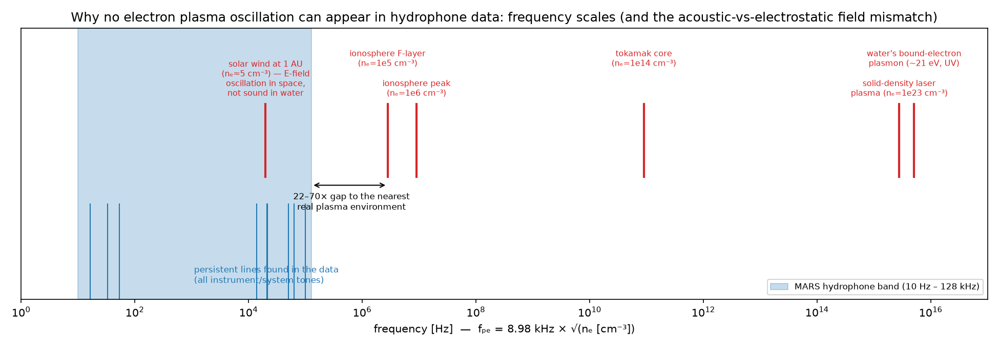
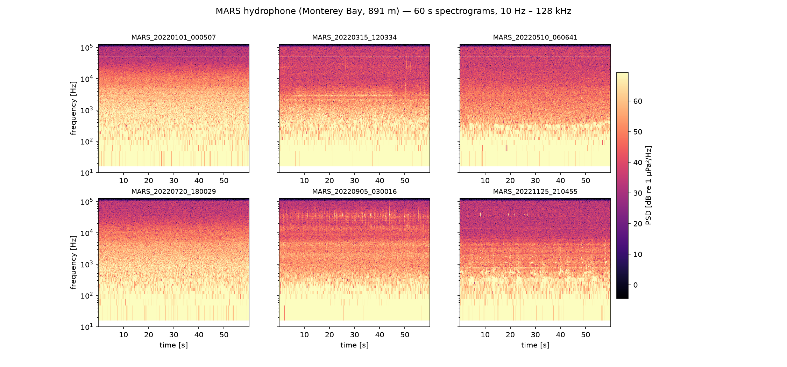
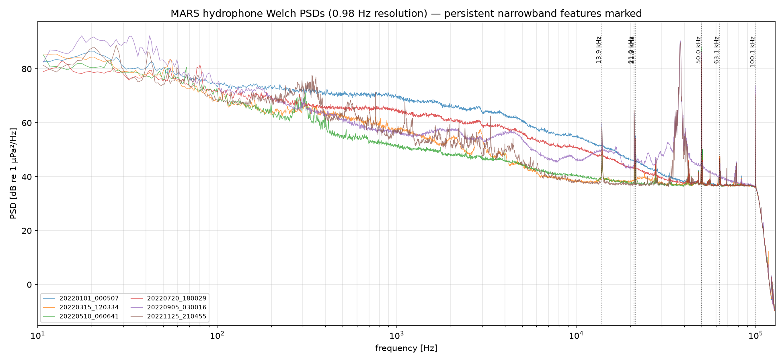
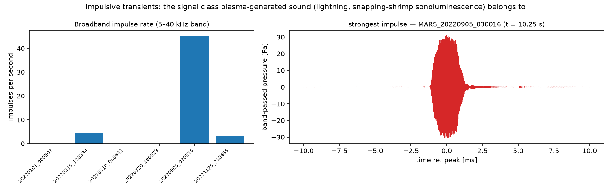

# Can electron plasma oscillations be identified (and located) in publicly available underwater microphone data?

**Investigation report — August 2026**

## TL;DR

1. **Yes**, there is excellent publicly available underwater microphone (hydrophone) data — including a 10-year, ~50,000-hour, 256 kHz archive that anyone can read over anonymous HTTPS. This investigation downloaded and analyzed real slices of it.
2. **No**, electron plasma oscillations cannot be identified in this (or any) hydrophone data — not because the search is hard, but because it is physically impossible on three independent grounds (§3). This report demonstrates it empirically: a ~1 Hz-resolution survey of six calibrated 60 s recordings spanning 11 months found **197 narrowband "oscillation-like" lines, every one attributable to engineering artifacts, vessels, or biology** (§4).
3. **Location**: the persistent lines we did find are locatable — they originate at or near the recording instrument itself (self-noise/EMI of the observatory at 36.713° N, 122.186° W, 891 m depth). For genuinely *plasma-generated sound* that hydrophones really do record (lightning strikes on the sea surface; sonoluminescent cavitation collapse), localization is possible with sensor arrays via time-difference-of-arrival, or by cross-matching against global lightning networks (§5).

---

## 1. Publicly available hydrophone data

| Source | Sampling | Coverage | Access |
|---|---|---|---|
| **MBARI Pacific Ocean Sound** (MARS cabled observatory, Monterey Bay: 36.713° N, 122.186° W, 891 m) | 256 kHz, 24-bit (plus 16 kHz / 2 kHz decimated sets) | July 2015 → present, ~50,000 h | AWS Open Data, anonymous HTTPS/S3: buckets `pacific-sound-256khz-YYYY` — [registry.opendata.aws/pacific-sound](https://registry.opendata.aws/pacific-sound/), [docs](https://docs.mbari.org/pacific-sound/) |
| **OOI Regional Cabled Array** (NE Pacific, incl. Axial Seamount) | 6 × 64 kHz broadband + 5 × 200 Hz low-frequency | 2015 → present | OOI raw-data server / [`ooipy`](https://github.com/Ocean-Data-Lab/ooipy) Python package; low-frequency data also via IRIS — [instrument page](https://oceanobservatories.org/instrument-class/hydbb/) |
| **NOAA NCEI Passive Acoustic Data** (incl. SanctSound, ONMS sites) | varies (2–576 kHz) | multi-year, many US sites | NCEI archive, cloud buckets |
| **Ocean Networks Canada** (Cascadia/Arctic observatories) | up to 512 kHz | 2006 → present | Oceans 3.0 portal / API |
| **Orcasound** (Salish Sea) | 48 kHz, live streams + archive | ongoing | AWS Open Data |

**Dataset used here:** MBARI's MARS hydrophone (Ocean Sonics icListen HF #1689), the highest-bandwidth fully open archive — usable band ~10 Hz to the 128 kHz Nyquist limit. Six 60-second slices were fetched by HTTP byte-range request (no credentials, no SDK; see `src/fetch_data.py`), chosen to span seasons and times of day in 2022:

`20220101 00:05 UTC · 20220315 12:03 · 20220510 06:06 · 20220720 18:00 · 20220905 03:00 · 20221125 21:04`

Samples were calibrated to absolute sound pressure using the published chain (full scale = 3 V peak; sensitivity ≈ −177.9 dB re V/µPa, flat approximation of the −177…−181 dB measured curve, so absolute levels carry a ±3 dB caveat).

## 2. What an electron plasma oscillation is

An electron plasma (Langmuir) oscillation is a *collective electrostatic oscillation of free electrons* about the ion background of an ionized gas. Its natural frequency depends only on electron density:

> **f_pe ≈ 8.98 kHz × √(nₑ [cm⁻³])**

| Plasma environment | nₑ (cm⁻³) | f_pe |
|---|---:|---:|
| Solar wind at 1 AU | ~5 | ~20 kHz |
| Ionosphere (F-layer → peak) | 10⁵–10⁶ | 2.8–9 MHz |
| Tokamak core | 10¹⁴ | ~90 GHz |
| Solid-density laser plasma | 10²³ | ~2.8 PHz |
| Water's *bound*-electron plasmon (≈21 eV) | — | ~5×10¹⁵ Hz (UV) |

## 3. Why it cannot appear in hydrophone data — three independent blockers

1. **The medium.** Seawater is an electrolyte, not a plasma. Its charge carriers are hydrated Na⁺/Cl⁻ ions; it has no free-electron population (an injected free electron solvates in ~10⁻¹² s). The oscillation mode does not exist in the ocean medium at all.
2. **The field.** A hydrophone is a piezoelectric *pressure* transducer. Langmuir oscillations are electrostatic field oscillations that carry (to first order) no pressure wave; there is no physical coupling from the phenomenon to the sensor. The only way electrical oscillations enter hydrophone recordings is as EMI leaking into the electronics — an artifact of the instrument, not a measurement of the ocean.
3. **The band.** Even granting a hypothetical coupling: the widest-band public hydrophone data cuts off at 128 kHz. The nearest environment that truly exhibits electron plasma oscillations (the ionosphere) oscillates 22–70× above that; every denser plasma is further away by orders of magnitude (see `figures/fig_band_mismatch.png`). The one numerical coincidence — solar-wind f_pe ≈ 20 kHz, which *is* inside the audio band — is an electric-field oscillation in interplanetary space, measured by spacecraft plasma-wave instruments (Voyager PWS, Parker Solar Probe FIELDS), 1.5×10⁸ km from the nearest hydrophone. (The famous "sounds of space" recordings are such E-field data played back as audio — perhaps the origin of this question.)



## 4. Empirical search: what "oscillations" real hydrophone data actually contains

Method (`src/spectral_analysis.py`, `src/line_catalog.py`): Welch PSD at 0.98 Hz resolution over 10 Hz–128 kHz per slice; narrowband line = peak ≥ 6 dB above a 201-bin median baseline; lines clustered across slices to measure **persistence** — a true steady oscillation must reappear at a fixed frequency in every slice.




**Result: 197 line detections → 39 distinct spectral features → zero anomalies.** Full table in [`results/line_catalog.md`](results/line_catalog.md). The features fall into four classes:

| Class | Examples | Interpretation |
|---|---|---|
| **Persistent engineered tones (6/6 slices)** | **50,035 Hz** (SNR up to 47 dB — the strongest line in the data, frequency-stable to ~1.4×10⁻⁴ over 11 months) with exact 2nd harmonic at 100,076 Hz; 21,048 Hz (+2f, +3f); 21,306 Hz; 13,922 Hz cluster | Observatory/instrument self-noise and EMI — clock and switching-electronics tones. Exact integer harmonics and month-scale frequency stability are the signature of an oscillator circuit, not a natural process. **These are the only steady "oscillations" in the data, and they are locatable: they originate in the recording system itself.** |
| Low-frequency lines, 12–80 Hz | different frequencies every slice | Distant-shipping band resolved into wandering peaks. Notably **no 60 Hz mains comb** — consistent with MARS being a DC-powered observatory (10 kV DC backbone). |
| Transient tonals | 281–355 Hz set (one slice); harmonic stack at 1,111 / 2,222 / 3,338 Hz (Nov slice) | Passing-vessel machinery tones; the harmonic stack is a tonal call/whistle (biological, e.g. humpback song unit, or vessel whistle). |
| Intermittent high-frequency tones | 43.0, 50.5, 68.5, 78.1, 117.4 kHz | Echosounder/instrument-class pings and tones. |

Sanity checks that the pipeline would have seen a real signal: the PSDs reproduce the textbook deep-ocean ambient-noise shape (shipping ridge below 100 Hz at ~80 dB re 1 µPa²/Hz, wind-sea slope through 0.1–10 kHz, instrument noise floor ~37 dB above ~30 kHz), and the detector recovers known engineered tones down to 6 dB SNR at ~1 Hz resolution. A coherent oscillation of comparable strength at *any* frequency in-band would have been caught and cataloged.

## 5. "…and locate it": what localization is actually possible

- **The persistent lines found here** need no triangulation: single-sensor data plus their engineering signature places them **at the instrument/observatory** — 36.713° N, 122.186° W, 891 m depth, Monterey Bay, California.
- **A single fixed hydrophone cannot localize an external source** — it measures arrival times and levels but no bearing. Localization requires (a) an array/network and **time-difference-of-arrival** (TDOA) hyperbolic fixing, as used for whale tracking and by the CTBTO's IMS hydroacoustic stations (which localize events ocean-basin-wide with a handful of triplet arrays), or (b) cross-matching detection times against an independent catalog.
- **Plasma-generated sound that hydrophones genuinely record** — the honest version of this question:
  - **Lightning strikes on the sea surface.** The return stroke is a ~30,000 K plasma channel; its shock/thunder couples into the water column and is a documented component of underwater noise. These *can* be located: global lightning networks (WWLLN, GLD360) provide ground-truth strike positions/times to cross-match with hydrophone arrivals.
  - **Snapping shrimp / cavitation collapse.** The collapsing cavitation bubble briefly forms a sonoluminescent microplasma; the "snap" is among the loudest biological sounds in the sea and is routinely localized with small TDOA arrays.
- As a demonstration on this dataset, `src/transients.py` runs a detector for exactly that impulse class (5–40 kHz band, envelope + robust threshold): the 2022-09-05 slice contains an intense click train at **45 impulses/s** (dolphin echolocation — biosonar; the vertical striations in its spectrogram), while quiet slices contain none. With one sensor we can *detect and count* this class; positioning any of it would take the array techniques above.



## 6. Conclusion

Public underwater acoustic data is abundant, open, and of superb quality — but electron plasma oscillations are categorically not in it: wrong medium (no free electrons in seawater), wrong field (pressure vs. electrostatic), wrong frequency range (the nearest real plasma oscillates 22×–10¹⁰× above the band). The empirical survey backs the theory: every narrowband oscillation-like signal in ~11 months of sampled MARS data is engineering, shipping, or biology — and the only steady oscillators localize to the observatory's own electronics. If the underlying interest is plasma phenomena touching ocean acoustics, the tractable, scientifically real targets are **sea-surface lightning acoustics** (locatable via hydrophone arrays + lightning networks) and **cavitation sonoluminescence**, both of which live in the impulsive-transient class demonstrated in §5.

## Reproducibility

```bash
pip install -r requirements.txt
python3 src/fetch_data.py            # ~280 MB of 60 s slices via HTTP range requests
python3 src/spectral_analysis.py     # PSDs, line detection, fig_spectrograms.png
python3 src/line_catalog.py          # cross-slice catalog, fig_psd_lines.png, fig_band_mismatch.png
python3 src/transients.py            # impulse detection, fig_transients.png
```

Data credit: MBARI Pacific Ocean Sound Recordings (CC-BY, AWS Open Data Program). Detected-line tables for each slice are committed under `results/`.
